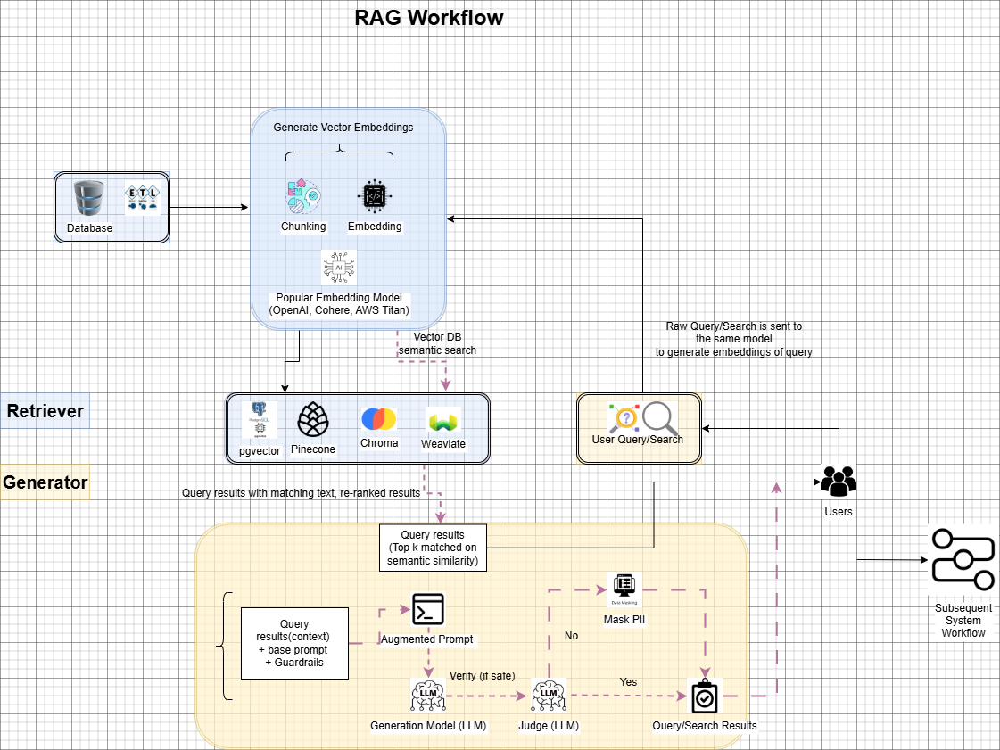

# Resume Search Engine with Vector Database

A semantic search application for resumes using pgvector, OpenAI embeddings, and Streamlit. The application supports both pure semantic search and hybrid search (combining vector similarity with text matching).

## Overview

This project implements a resume search engine that uses:
- OpenAI's text embeddings for semantic understanding
- PostgreSQL with pgvector for vector similarity search
- Streamlit for an interactive web interface
- Hybrid search combining vector similarity with text matching

## Architecture 

## Dataset

This project uses the [Resume Dataset from Kaggle](https://www.kaggle.com/datasets/snehaanbhawal/resume-dataset). 

**Setup Steps for Dataset:**
1. Download the dataset from Kaggle
2. Create directory structure:
   ```bash
   mkdir -p data/Resume data/processed
   ```
3. Place the `Resume.csv` file in the `data/Resume/` directory

## Prerequisites

1. **Python Environment**
   - Python 3.11 or higher
   - pip package manager

2. **Docker Setup**
   - Install Docker Desktop:
     - [Windows Installation Guide](https://docs.docker.com/desktop/install/windows-install/)
     - [Mac Installation Guide](https://docs.docker.com/desktop/install/mac-install/)
     - [Linux Installation Guide](https://docs.docker.com/desktop/install/linux-install/)
   - Start Docker Desktop
   - Verify installation:
     ```bash
     docker --version
     docker-compose --version
     ```

3. **OpenAI API Key**
   - Create account on [OpenAI Platform](https://platform.openai.com/)
   - Generate API key from account settings
   - Keep the key handy for configuration

## Project Structure

```
vecdb-compare/
├── app_mods/              # Streamlit application files
│   └── 06_streamlit_app.py
├── data/
│   ├── processed/        # Processed data with embeddings
│   └── Resume/          # Raw resume dataset
├── src/                 # Source code
│   ├── 01_data_collection.py
│   ├── 03_upload_to_db.py
│   ├── _04_query_db.py
│   └── _05_hybrid_search.py
├── docker-compose.yml   # Docker configuration
├── requirements.txt     # Python dependencies
└── .env                # Environment variables
```

## Setup Instructions

1. **Clone Repository**
   ```bash
   git clone <repository-url>
   cd vecdb-compare
   ```

2. **Virtual Environment**
   ```bash
   # Create virtual environment
   python -m venv venv

   # Activate (Windows)
   .\venv\Scripts\activate
   
   # Activate (Unix/MacOS)
   source venv/bin/activate
   ```

3. **Install Dependencies**
   ```bash
   pip install -r requirements.txt
   ```

4. **Environment Configuration**
   Create `.env` file in root directory:
   ```plaintext
   OPENAI_API_KEY=your-api-key-here
   ```

5. **Database Setup**
   ```bash
   # Start PostgreSQL with pgvector
   docker-compose up -d

   # Verify container is running
   docker ps
   ```

6. **Data Processing**
   ```bash
   # Generate embeddings
   python src/01_data_collection.py

   # Upload to database
   python src/03_upload_to_db.py
   ```

7. **Launch Application**
   ```bash
   streamlit run app_mods/06_streamlit_app.py
   ```

## Using the Application

1. **Access the Interface**
   - Open browser: http://localhost:8501
   - Enter OpenAI API key in sidebar

2. **Search Options**
   - Choose search type:
     - Semantic Search: Pure vector similarity
     - Hybrid Search: Combined vector and text matching
   
3. **Query Input**
   - Enter desired job profile description
   - Adjust number of results (1-10)
   - View matches with similarity scores

## Database Schema

```sql
CREATE TABLE resumes (
    id SERIAL PRIMARY KEY,
    category TEXT,
    resume_text TEXT,
    embedding vector(256)
);

-- Vector similarity search index
CREATE INDEX ON resumes 
USING hnsw (embedding vector_cosine_ops)
WITH (
    m = 16,
    ef_construction = 64
);
```

## Troubleshooting

1. **Docker Issues**
   - Ensure Docker Desktop is running
   - Check container status: `docker ps`
   - View logs: `docker logs timescaledb`

2. **Database Connection**
   - Verify PostgreSQL port (5432) is not in use
   - Check database credentials match docker-compose.yml

3. **OpenAI API**
   - Ensure API key is valid
   - Check for sufficient API credits
